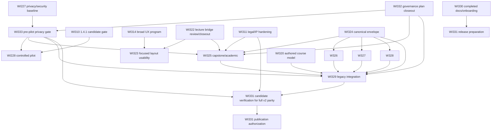

# SkillForge Academy Work Reconciliation and Gated Execution Roadmap

**Snapshot:** 2026-10-09, freshly fetched and rebased `origin/main` at
`e46d4227117a6a0a16bcb41430cfe429a82de880` (includes PR #14 and PR #15).

This map is the human-readable guide to the canonical RepoPact registry in
`work/`. It records the current plan and evidence boundaries; it does not mark
unverified work complete. The merged WI330 documentation modernization now
documents the canonical `work/`, `audits/`, `decisions/`, and `evidence/`
layout and contributor process.

## Executive status

- Latest public main: `e46d422`. WI324 implementation PR #12 and governance
  closeout PR #13 are merged; WI324 is completed with the canonical learner
  envelope as the single generic platform persistence owner (decision 0011).
- WI330's implementation PR #14 and governance closeout PR #15 are merged. WI330
  is completed, with all eight criteria and linked evidence present on main.
- WI331 is canonical on main as proposed work. Its previous blanket dependency
  list is narrowed in this PR to WI330 for the preparation phase; the README
  retains candidate-verification and publication gates.
- WI323 existed only as an untracked proposed item in the preserved
  `ux-follow-up-candidate` worktree at `72a8ecb`. Its original record is carried
  forward without changing its identity, purpose, scope, preflight, criteria,
  or evidence. The maintainer accepted its scope. All five criteria remain
  pending, so its canonical status is **proposed**, dependent on WI314 and WI322.
- WI322's bridge code and candidate evidence are on main, but its RepoPact
  criteria are still pending and no independent-review closeout is linked. It
  remains **active** until that gap is resolved.
- WI310's evidence identifies the historical `1.4.1-beta.1` binary. AC-4
  packaged acceptance remains pending; its old installer evidence cannot
  qualify a v2.0 candidate.
- WI312's pilot safeguards moved to proposed WI333. WI228 now depends on WI333
  and WI310. Later institutional/hosted/minor-data architecture in WI312 no
  longer blocks a properly bounded local-first pilot.
- WI331 has no candidate artifact or implementation evidence. Its six criteria
  remain pending. WI330's completed docs are the only RepoPact start dependency;
  candidate verification and publication remain separately gated.
- No feature implementation from WI325–WI329 is present in this change. Those
  items remain proposed and use WI324's envelope API rather than defining
  parallel state stores.

## Canonical work inventory

The table enumerates all 69 canonical work items: 51 completed, 4 active, 11
proposed, 2 blocked, and 1 deferred. Each row records status, dependencies,
source/implementation state, criteria/evidence, and disposition.
The RepoPact records remain authoritative for acceptance and evidence.
Historical completed items remain
completed with their evidence references; no live feature branch was found for
them. The detailed source/test/evidence trace for active and upcoming work
follows the inventory.

<!-- INVENTORY:START -->
| Work item and title | Current status / registration | Depends on | Implementation, acceptance, and evidence | Overlap and proposed disposition |
| --- | --- | --- | --- | --- |
| [000 — Adopt RepoPact into the existing repository](../work/completed/000-adopt-repopact/README.md) | `completed`; canonical main record (updated on this PR branch) | — | Canonical main history; no live source branch/worktree identified. Source/test notes and formal evidence are linked by this RepoPact record. AC: 2 satisfied, 0 waived, 0 pending; 1 evidence refs. | Retain as completed history; no open overlap identified in this reconciliation. |
| [001 — TODO-001: True Certification Factory](../work/completed/001-true-cert-factory/README.md) | `completed`; canonical main record (updated on this PR branch) | — | Canonical main history; no live source branch/worktree identified. Source/test notes and formal evidence are linked by this RepoPact record. AC: 1 satisfied, 0 waived, 0 pending; 1 evidence refs. | Retain as completed history; no open overlap identified in this reconciliation. |
| [002 — TODO-002: Certification Authoring Guide And Quality Rubric](../work/completed/002-cert-authoring-guide/README.md) | `completed`; canonical main record (updated on this PR branch) | — | Canonical main history; no live source branch/worktree identified. Source/test notes and formal evidence are linked by this RepoPact record. AC: 1 satisfied, 0 waived, 0 pending; 1 evidence refs. | Retain as completed history; no open overlap identified in this reconciliation. |
| [003 — TODO-003: Network+ Starter Track](../work/completed/003-network-plus-starter-track/README.md) | `completed`; canonical main record (updated on this PR branch) | — | Canonical main history; no live source branch/worktree identified. Source/test notes and formal evidence are linked by this RepoPact record. AC: 1 satisfied, 0 waived, 0 pending; 1 evidence refs. | Retain as completed history; no open overlap identified in this reconciliation. |
| [004 — TODO-004: Security+ Starter Track](../work/completed/004-security-plus-starter-track/README.md) | `completed`; canonical main record (updated on this PR branch) | — | Canonical main history; no live source branch/worktree identified. Source/test notes and formal evidence are linked by this RepoPact record. AC: 1 satisfied, 0 waived, 0 pending; 1 evidence refs. | Retain as completed history; no open overlap identified in this reconciliation. |
| [005 — TODO-005: Multi-Track UX, Availability, And Analytics](../work/completed/005-multi-track-ux-and-analytics/README.md) | `completed`; canonical main record (updated on this PR branch) | — | Canonical main history; no live source branch/worktree identified. Source/test notes and formal evidence are linked by this RepoPact record. AC: 1 satisfied, 0 waived, 0 pending; 1 evidence refs. | Retain as completed history; no open overlap identified in this reconciliation. |
| [006 — TODO-006: Multi-Cert Brand, Docs, And Release Readiness](../work/completed/006-multi-cert-brand-docs-and-release-readiness/README.md) | `completed`; canonical main record (updated on this PR branch) | — | Canonical main history; no live source branch/worktree identified. Source/test notes and formal evidence are linked by this RepoPact record. AC: 1 satisfied, 0 waived, 0 pending; 1 evidence refs. | Retain as completed history; no open overlap identified in this reconciliation. |
| [007 — TODO-007: Multi-Certification Plan Reconciliation Audit](../work/completed/007-multi-cert-plan-reconciliation-audit/README.md) | `completed`; canonical main record (updated on this PR branch) | — | Canonical main history; no live source branch/worktree identified. Source/test notes and formal evidence are linked by this RepoPact record. AC: 1 satisfied, 0 waived, 0 pending; 1 evidence refs. | Retain as completed history; no open overlap identified in this reconciliation. |
| [202 — Structured learning paths and objective search](../work/completed/202-structured-learning-paths-and-objective-search/README.md) | `completed`; canonical main record (updated on this PR branch) | — | Canonical main history; no live source branch/worktree identified. Source/test notes and formal evidence are linked by this RepoPact record. AC: 0 satisfied, 1 waived, 0 pending; 0 evidence refs. | Retain as completed history; no open overlap identified in this reconciliation. |
| [203 — Original practice questions, flashcards, and PBQs](../work/completed/203-original-practice-questions-flashcards-and-pbqs/README.md) | `completed`; canonical main record (updated on this PR branch) | — | Canonical main history; no live source branch/worktree identified. Source/test notes and formal evidence are linked by this RepoPact record. AC: 0 satisfied, 1 waived, 0 pending; 0 evidence refs. | Retain as completed history; no open overlap identified in this reconciliation. |
| [204 — SM-2 spaced repetition](../work/completed/204-sm-2-spaced-repetition/README.md) | `completed`; canonical main record (updated on this PR branch) | — | Canonical main history; no live source branch/worktree identified. Source/test notes and formal evidence are linked by this RepoPact record. AC: 0 satisfied, 1 waived, 0 pending; 0 evidence refs. | Retain as completed history; no open overlap identified in this reconciliation. |
| [205 — Configurable timed mock exams](../work/completed/205-configurable-timed-mock-exams/README.md) | `completed`; canonical main record (updated on this PR branch) | — | Canonical main history; no live source branch/worktree identified. Source/test notes and formal evidence are linked by this RepoPact record. AC: 0 satisfied, 1 waived, 0 pending; 0 evidence refs. | Retain as completed history; no open overlap identified in this reconciliation. |
| [206 — Local analytics, notes, bookmarks, and progress tracking](../work/completed/206-local-analytics-notes-bookmarks-and-progress-tracking/README.md) | `completed`; canonical main record (updated on this PR branch) | — | Canonical main history; no live source branch/worktree identified. Source/test notes and formal evidence are linked by this RepoPact record. AC: 0 satisfied, 1 waived, 0 pending; 0 evidence refs. | Retain as completed history; no open overlap identified in this reconciliation. |
| [207 — Passphrase-protected portable backups](../work/completed/207-passphrase-protected-portable-backups/README.md) | `completed`; canonical main record (updated on this PR branch) | — | Canonical main history; no live source branch/worktree identified. Source/test notes and formal evidence are linked by this RepoPact record. AC: 0 satisfied, 1 waived, 0 pending; 0 evidence refs. | Retain as completed history; no open overlap identified in this reconciliation. |
| [208 — Automated Windows release builds and checksums](../work/completed/208-automated-windows-release-builds-and-checksums/README.md) | `completed`; canonical main record (updated on this PR branch) | — | Canonical main history; no live source branch/worktree identified. Source/test notes and formal evidence are linked by this RepoPact record. AC: 0 satisfied, 1 waived, 0 pending; 0 evidence refs. | Retain as completed history; no open overlap identified in this reconciliation. |
| [209 — Baseline keyboard and accessibility validation](../work/completed/209-baseline-keyboard-and-accessibility-validation/README.md) | `completed`; canonical main record (updated on this PR branch) | — | Canonical main history; no live source branch/worktree identified. Source/test notes and formal evidence are linked by this RepoPact record. AC: 0 satisfied, 1 waived, 0 pending; 0 evidence refs. | Retain as completed history; no open overlap identified in this reconciliation. |
| [210 — Expand original assessment content and simulation formats](../work/completed/210-expand-original-assessment-content-and-simulation-formats/README.md) | `completed`; canonical main record (updated on this PR branch) | — | Canonical main history; no live source branch/worktree identified. Source/test notes and formal evidence are linked by this RepoPact record. AC: 3 satisfied, 1 waived, 0 pending; 1 evidence refs. | Retain as completed history; no open overlap identified in this reconciliation. |
| [211 — Add stable public screenshots and onboarding documentation](../work/completed/211-add-stable-public-screenshots-and-onboarding-documentation/README.md) | `completed`; canonical main record (updated on this PR branch) | — | Canonical main history; no live source branch/worktree identified. Source/test notes and formal evidence are linked by this RepoPact record. AC: 4 satisfied, 0 waived, 0 pending; 1 evidence refs. | Retain as completed history; no open overlap identified in this reconciliation. |
| [212 — Add installer code signing when a trusted certificate is available](../work/blocked/212-add-installer-code-signing-when-a-trusted-certificate-is-ava/README.md) | `blocked`; canonical main record (updated on this PR branch) | — | Canonical blocker record; signing docs exist, signing implementation not done. AC: 0 satisfied, 0 waived, 1 pending; 0 evidence refs. | Blocked on trusted certificate and identity validation; preserve external blocker. |
| [213 — Continue keyboard-only and assistive-technology testing](../work/completed/213-continue-keyboard-only-and-assistive-technology-testing/README.md) | `completed`; canonical main record (updated on this PR branch) | — | Canonical main history; no live source branch/worktree identified. Source/test notes and formal evidence are linked by this RepoPact record. AC: 3 satisfied, 1 waived, 0 pending; 1 evidence refs. | Retain as completed history; no open overlap identified in this reconciliation. |
| [214 — Prepare the content model for additional certification tracks](../work/completed/214-prepare-the-content-model-for-additional-certification-track/README.md) | `completed`; canonical main record (updated on this PR branch) | — | Canonical main history; no live source branch/worktree identified. Source/test notes and formal evidence are linked by this RepoPact record. AC: 3 satisfied, 1 waived, 0 pending; 1 evidence refs. | Retain as completed history; no open overlap identified in this reconciliation. |
| [215 — Build course lessons and real-world class content](../work/completed/215-course-lessons-and-real-world-class-content/README.md) | `completed`; canonical main record (updated on this PR branch) | 210, 214 | Canonical main history; no live source branch/worktree identified. Source/test notes and formal evidence are linked by this RepoPact record. AC: 5 satisfied, 0 waived, 0 pending; 1 evidence refs. | Retain as completed history; no open overlap identified in this reconciliation. |
| [216 — Add further simulation formats and expand multi-select content](../work/completed/216-add-further-simulation-formats-and-expand-multi-select-content/README.md) | `completed`; canonical main record (updated on this PR branch) | 210 | Canonical main history; no live source branch/worktree identified. Source/test notes and formal evidence are linked by this RepoPact record. AC: 2 satisfied, 0 waived, 0 pending; 1 evidence refs. | Retain as completed history; no open overlap identified in this reconciliation. |
| [217 — Add Tauri Android mobile support foundation](../work/completed/217-tauri-android-mobile-support-foundation/README.md) | `completed`; canonical main record (updated on this PR branch) | — | Canonical main history; no live source branch/worktree identified. Source/test notes and formal evidence are linked by this RepoPact record. AC: 8 satisfied, 0 waived, 0 pending; 4 evidence refs. | Retain as completed history; no open overlap identified in this reconciliation. |
| [218 — Add Tauri iOS mobile support foundation](../work/blocked/218-tauri-ios-mobile-support-foundation/README.md) | `blocked`; canonical main record (updated on this PR branch) | 217 | Canonical blocker record; scripts/docs exist, iOS runtime proof not done. AC: 4 satisfied, 0 waived, 5 pending; 1 evidence refs. | Blocked on macOS/Xcode and iOS runtime environment; preserve external blocker. |
| [219 — Release candidate, version, installer, and upgrade audit](../work/completed/219-release-candidate-version-and-upgrade-audit/README.md) | `completed`; canonical main record (updated on this PR branch) | 305 | Canonical main history; no live source branch/worktree identified. Source/test notes and formal evidence are linked by this RepoPact record. AC: 5 satisfied, 0 waived, 0 pending; 1 evidence refs. | Retain as completed history; no open overlap identified in this reconciliation. |
| [220 — Real screen-reader walkthrough](../work/completed/220-real-screen-reader-walkthrough/README.md) | `completed`; canonical main record (updated on this PR branch) | 213 | Canonical main history; no live source branch/worktree identified. Source/test notes and formal evidence are linked by this RepoPact record. AC: 4 satisfied, 1 waived, 0 pending; 1 evidence refs. | Retain as completed history; no open overlap identified in this reconciliation. |
| [221 — Cross-platform backup, import, and export hardening](../work/completed/221-cross-platform-backup-import-export-hardening/README.md) | `completed`; canonical main record (updated on this PR branch) | 207, 217, 218 | Canonical main history; no live source branch/worktree identified. Source/test notes and formal evidence are linked by this RepoPact record. AC: 5 satisfied, 0 waived, 0 pending; 1 evidence refs. | Retain as completed history; no open overlap identified in this reconciliation. |
| [222 — Content quality and assessment calibration audit](../work/completed/222-content-quality-and-assessment-calibration-audit/README.md) | `completed`; canonical main record (updated on this PR branch) | 215, 216 | Canonical main history; no live source branch/worktree identified. Source/test notes and formal evidence are linked by this RepoPact record. AC: 5 satisfied, 0 waived, 0 pending; 1 evidence refs. | Retain as completed history; no open overlap identified in this reconciliation. |
| [223 — Official certification objective drift watch](../work/completed/223-official-objective-drift-watch/README.md) | `completed`; canonical main record (updated on this PR branch) | 214, 304, 305 | Canonical main history; no live source branch/worktree identified. Source/test notes and formal evidence are linked by this RepoPact record. AC: 5 satisfied, 0 waived, 0 pending; 1 evidence refs. | Retain as completed history; no open overlap identified in this reconciliation. |
| [224 — Next-generation PBQ UX depth](../work/completed/224-next-generation-pbq-ux-depth/README.md) | `completed`; canonical main record (updated on this PR branch) | 216 | Canonical main history; no live source branch/worktree identified. Source/test notes and formal evidence are linked by this RepoPact record. AC: 5 satisfied, 0 waived, 0 pending; 1 evidence refs. | Retain as completed history; no open overlap identified in this reconciliation. |
| [225 — Local diagnostics and error-reporting stance](../work/completed/225-local-diagnostics-and-error-reporting-stance/README.md) | `completed`; canonical main record (updated on this PR branch) | — | Canonical main history; no live source branch/worktree identified. Source/test notes and formal evidence are linked by this RepoPact record. AC: 5 satisfied, 0 waived, 0 pending; 3 evidence refs. | Retain as completed history; no open overlap identified in this reconciliation. |
| [226 — Support and troubleshooting documentation](../work/completed/226-support-and-troubleshooting-docs/README.md) | `completed`; canonical main record (updated on this PR branch) | 219, 221, 225 | Canonical main history; no live source branch/worktree identified. Source/test notes and formal evidence are linked by this RepoPact record. AC: 5 satisfied, 0 waived, 0 pending; 1 evidence refs. | Retain as completed history; no open overlap identified in this reconciliation. |
| [227 — Privacy and security review for local state, backups, and mobile](../work/completed/227-privacy-security-review-local-state-backups-mobile/README.md) | `completed`; canonical main record (updated on this PR branch) | 207, 217, 218, 221, 225 | Canonical main history; no live source branch/worktree identified. Source/test notes and formal evidence are linked by this RepoPact record. AC: 6 satisfied, 0 waived, 0 pending; 1 evidence refs. | Retain as completed history; no open overlap identified in this reconciliation. |
| [228 — Real learner beta pilot and feedback loop](../work/deferred/228-real-learner-beta-pilot-and-feedback-loop/README.md) | `deferred`; canonical main record (updated on this PR branch) | 219, 220, 221, 222, 225, 226, 227, 308, 309, 310, 333 | Canonical pilot definition; no participant run or implementation evidence. AC: 0 satisfied, 0 waived, 5 pending; 0 evidence refs. | Deferred until WI310 and new pre-pilot WI333 are complete. |
| [300 — M0: A+ MVP](../work/completed/300-milestone-a-mvp/README.md) | `completed`; canonical main record (updated on this PR branch) | — | Canonical main history; no live source branch/worktree identified. Source/test notes and formal evidence are linked by this RepoPact record. AC: 0 satisfied, 1 waived, 0 pending; 0 evidence refs. | Retain as completed history; no open overlap identified in this reconciliation. |
| [301 — M1: Repo-Native Work Foundation](../work/completed/301-milestone-repo-native-work-foundation/README.md) | `completed`; canonical main record (updated on this PR branch) | — | Canonical main history; no live source branch/worktree identified. Source/test notes and formal evidence are linked by this RepoPact record. AC: 0 satisfied, 1 waived, 0 pending; 0 evidence refs. | Retain as completed history; no open overlap identified in this reconciliation. |
| [302 — M2: True Certification Factory](../work/completed/302-milestone-true-certification-factory/README.md) | `completed`; canonical main record (updated on this PR branch) | — | Canonical main history; no live source branch/worktree identified. Source/test notes and formal evidence are linked by this RepoPact record. AC: 1 satisfied, 0 waived, 0 pending; 1 evidence refs. | Retain as completed history; no open overlap identified in this reconciliation. |
| [303 — M3: First Additional Certification](../work/completed/303-milestone-first-additional-certification/README.md) | `completed`; canonical main record (updated on this PR branch) | — | Canonical main history; no live source branch/worktree identified. Source/test notes and formal evidence are linked by this RepoPact record. AC: 1 satisfied, 0 waived, 0 pending; 1 evidence refs. | Retain as completed history; no open overlap identified in this reconciliation. |
| [304 — M4: Second Additional Certification](../work/completed/304-milestone-second-additional-certification/README.md) | `completed`; canonical main record (updated on this PR branch) | — | Canonical main history; no live source branch/worktree identified. Source/test notes and formal evidence are linked by this RepoPact record. AC: 1 satisfied, 0 waived, 0 pending; 1 evidence refs. | Retain as completed history; no open overlap identified in this reconciliation. |
| [305 — M5: Multi-Cert Launch Readiness](../work/completed/305-milestone-multi-cert-launch-readiness/README.md) | `completed`; canonical main record (updated on this PR branch) | — | Canonical main history; no live source branch/worktree identified. Source/test notes and formal evidence are linked by this RepoPact record. AC: 1 satisfied, 0 waived, 0 pending; 1 evidence refs. | Retain as completed history; no open overlap identified in this reconciliation. |
| [306 — Consume RepoPact from PyPI (repopact==1.8.0)](../work/completed/306-repopact-pypi-consumption/README.md) | `completed`; canonical main record (updated on this PR branch) | — | Canonical main history; no live source branch/worktree identified. Source/test notes and formal evidence are linked by this RepoPact record. AC: 3 satisfied, 0 waived, 0 pending; 1 evidence refs. | Retain as completed history; no open overlap identified in this reconciliation. |
| [307 — Upgrade RepoPact to 2.2.0](../work/completed/307-repopact-2-2-0-upgrade/README.md) | `completed`; canonical main record (updated on this PR branch) | 306 | Canonical main history; no live source branch/worktree identified. Source/test notes and formal evidence are linked by this RepoPact record. AC: 4 satisfied, 0 waived, 0 pending; 1 evidence refs. | Retain as completed history; no open overlap identified in this reconciliation. |
| [308 — UX and information-architecture audit](../work/completed/308-ux-and-information-architecture-audit/README.md) | `completed`; canonical main record (updated on this PR branch) | 226 | Canonical main history; no live source branch/worktree identified. Source/test notes and formal evidence are linked by this RepoPact record. AC: 5 satisfied, 0 waived, 0 pending; 2 evidence refs. | Retain as completed history; no open overlap identified in this reconciliation. |
| [309 — Primary vs secondary navigation IA pass](../work/completed/309-primary-vs-secondary-navigation-ia-pass/README.md) | `completed`; canonical main record (updated on this PR branch) | 308 | Canonical main history; no live source branch/worktree identified. Source/test notes and formal evidence are linked by this RepoPact record. AC: 4 satisfied, 0 waived, 0 pending; 2 evidence refs. | Retain as completed history; no open overlap identified in this reconciliation. |
| [310 — Pre-beta candidate refresh and operational readiness gate](../work/active/310-pre-beta-candidate-refresh-and-operational-readiness-gate/README.md) | `active`; canonical main record (updated on this PR branch) | 219, 220, 221, 222, 225, 226, 227, 308, 309 | Canonical main; frozen historical installer/runbook, no current app implementation branch. AC: 5 satisfied, 1 waived, 1 pending; 5 evidence refs. | Historical 1.4.1-beta.1 evidence only; AC-4 packaged acceptance remains pending. Retain active. |
| [311 — CompTIA legal, trademark, and content-IP hardening](../work/active/311-comptia-legal-trademark-and-content-ip-hardening/README.md) | `active`; canonical main record (updated on this PR branch) | — | Canonical main; work definition only, no implementation/evidence branch found. AC: 0 satisfied, 0 waived, 8 pending; 0 evidence refs. | Active legal/IP and provenance scope; no closed criteria or evidence yet. |
| [312 — Learner Privacy, Minor, and Institutional Data Boundary](../work/proposed/312-learner-privacy-minor-and-institutional-data-boundary/README.md) | `proposed`; canonical main record (updated on this PR branch) | — | Canonical policy definition; no runtime code. AC: 0 satisfied, 0 waived, 7 pending; 0 evidence refs. | Proposed future hosted/institutional/minor-data boundary; WI333 owns pre-pilot controls. |
| [313 — Certification Content Depth, Assessment Breadth, and Mastery Parity](../work/proposed/313-certification-content-depth-assessment-breadth-and-mastery-parity/README.md) | `proposed`; canonical main record (updated on this PR branch) | 310, 311 | Canonical proposal; no implementation/evidence. AC: 0 satisfied, 0 waived, 10 pending; 0 evidence refs. | Gate 5; preserve original-content and readiness boundaries. |
| [314 — Learner UI/UX Competitive Parity and Polished Cross-Platform Study Experience](../work/proposed/314-learner-ui-ux-competitive-parity-and-polish/README.md) | `proposed`; canonical main record (updated on this PR branch) | 310 | Canonical proposal; no implementation/evidence. AC: 0 satisfied, 0 waived, 12 pending; 0 evidence refs. | Gate 5 broad UX program; WI323 remains a distinct focused child. |
| [315 — Adopt RepoPact 3.0.2](../work/completed/315-repopact-3-0-2-adoption/README.md) | `completed`; canonical main record (updated on this PR branch) | 307 | Canonical main history; no live source branch/worktree identified. Source/test notes and formal evidence are linked by this RepoPact record. AC: 4 satisfied, 0 waived, 0 pending; 1 evidence refs. | Retain as completed history; no open overlap identified in this reconciliation. |
| [316 — Public Platform Extraction V1 and Course Package Architecture V1](../work/completed/316-public-platform-extraction-v1-course-packages-v1/README.md) | `completed`; canonical main record (updated on this PR branch) | — | Canonical main history; no live source branch/worktree identified. Source/test notes and formal evidence are linked by this RepoPact record. AC: 7 satisfied, 0 waived, 0 pending; 1 evidence refs. | Retain as completed history; no open overlap identified in this reconciliation. |
| [317 — Platform Extraction V1.1 Modern Runtime Parity](../work/completed/317-platform-extraction-v1-1-modern-runtime-parity/README.md) | `completed`; canonical main record (updated on this PR branch) | 316 | Canonical main history; no live source branch/worktree identified. Source/test notes and formal evidence are linked by this RepoPact record. AC: 6 satisfied, 0 waived, 0 pending; 1 evidence refs. | Retain as completed history; no open overlap identified in this reconciliation. |
| [318 — Platform Extraction V1.2 Semantic Parity Closure](../work/completed/318-platform-extraction-v1-2-semantic-parity-closure/README.md) | `completed`; canonical main record (updated on this PR branch) | 317 | Canonical main history; no live source branch/worktree identified. Source/test notes and formal evidence are linked by this RepoPact record. AC: 5 satisfied, 0 waived, 0 pending; 1 evidence refs. | Retain as completed history; no open overlap identified in this reconciliation. |
| [319 — Platform Extraction V1.2.1 Cross-Runtime Conformance](../work/completed/319-platform-extraction-v1-2-1-cross-runtime-conformance/README.md) | `completed`; canonical main record (updated on this PR branch) | 318 | Canonical main history; no live source branch/worktree identified. Source/test notes and formal evidence are linked by this RepoPact record. AC: 5 satisfied, 0 waived, 0 pending; 1 evidence refs. | Retain as completed history; no open overlap identified in this reconciliation. |
| [320 — Canonical Authored Course Model V1.3](../work/completed/320-canonical-authored-course-model-v1-3/README.md) | `completed`; canonical main record (updated on this PR branch) | 319 | Canonical main history; no live source branch/worktree identified. Source/test notes and formal evidence are linked by this RepoPact record. AC: 4 satisfied, 0 waived, 0 pending; 1 evidence refs. | Retain as completed history; no open overlap identified in this reconciliation. |
| [321 — Private Branch Exposure Remediation 2026-10-05](../work/completed/321-private-branch-exposure-remediation-2026-10-05/README.md) | `completed`; canonical main record (updated on this PR branch) | 320 | Canonical main history; no live source branch/worktree identified. Source/test notes and formal evidence are linked by this RepoPact record. AC: 6 satisfied, 0 waived, 0 pending; 1 evidence refs. | Retain as completed history; no open overlap identified in this reconciliation. |
| [322 — Lecture Formal Activity UI Bridge](../work/active/322-lecture-formal-activity-ui-bridge/README.md) | `active`; canonical main record (updated on this PR branch) | 319, 321 | Canonical main includes bridge source commits 846cc19/762837f; branch-era evidence retained. AC: 0 satisfied, 0 waived, 8 pending; 1 evidence refs. | Code is present but criteria remain pending; no independent review/closeout linked. Keep active. |
| [323 — Classroom and Authored Activity Layout Usability](../work/proposed/323-classroom-and-authored-activity-layout-usability/README.md) | `proposed`; copied from `ux-follow-up-candidate`; canonical registration is this PR | 314, 322 | Original proposal copied from ux-follow-up-candidate at 72a8ecb; no WI323 source changes or evidence found. AC: 0 satisfied, 0 waived, 5 pending; 0 evidence refs. | Maintainer accepted scope only. Keep proposed; start after WI314 and WI322. |
| [324 — Canonical Learner Envelope and Serialized Persistence](../work/completed/324-canonical-learner-envelope-serialized-persistence/README.md) | `completed`; canonical main record (updated on this PR branch) | 320 | Implementation merged through PR #12; governance closeout merged through PR #13. AC: 13 satisfied, 0 waived, 0 pending; 5 evidence refs. | Completed with evidence; decision 0011 preserves one envelope owner. Do not duplicate persistence. |
| [325 — Capstone Stage Context, Evaluation, and Academic Record Parity](../work/proposed/325-capstone-stage-context-evaluation-academic-record-parity/README.md) | `proposed`; canonical main record (updated on this PR branch) | 311, 322, 324, 332, 333 | Canonical proposal; no source implementation/evidence. AC: 0 satisfied, 0 waived, 4 pending; 0 evidence refs. | Gate 2; capstone/projection only; use WI324 API. |
| [326 — Persistent Lecture Delivery State](../work/proposed/326-persistent-lecture-delivery-state/README.md) | `proposed`; canonical main record (updated on this PR branch) | 324 | Canonical proposal; no source implementation/evidence. AC: 0 satisfied, 0 waived, 3 pending; 0 evidence refs. | WI324 API; lecture-local state may proceed. WI322 owner decision for formal activity contract changes; Gate O for protected-path edits. |
| [327 — Reachable Lab Completion and Persistent Lab Runs](../work/proposed/327-reachable-lab-completion-persistent-lab-runs/README.md) | `proposed`; canonical main record (updated on this PR branch) | 324 | Canonical proposal; no source implementation/evidence. AC: 0 satisfied, 0 waived, 3 pending; 0 evidence refs. | WI324 API and synthetic fixtures; Gate O applies only before protected-path edits. |
| [328 — Native Windows Encrypted Backup and Restore](../work/proposed/328-native-windows-encrypted-backup-restore/README.md) | `proposed`; canonical main record (updated on this PR branch) | 324 | Canonical proposal; no source implementation/evidence. AC: 0 satisfied, 0 waived, 3 pending; 0 evidence refs. | New Windows backup/restore evidence; synthetic fixtures; Gate O before protected-path edits. |
| [329 — Legacy Certification Runtime and Feature Parity](../work/proposed/329-legacy-certification-runtime-feature-parity/README.md) | `proposed`; canonical main record (updated on this PR branch) | 311, 320, 322, 324, 325, 326, 327, 328, 332, 333 | Canonical proposal; no source implementation/evidence. AC: 0 satisfied, 0 waived, 4 pending; 0 evidence refs. | Gate 3 integration after WI325-WI328; own compatibility without new state authority. |
| [330 — Documentation modernization and contributor onboarding](../work/completed/330-documentation-modernization-and-contributor-onboarding/README.md) | `completed`; canonical main record; PR #14 implementation and PR #15 governance closeout merged | — | Docs, onboarding, and documentation validator merged through PR #14 (`fed5f15`); PR #15 closeout at `e46d422`. AC: 8 satisfied, 0 waived, 0 pending; 10 evidence refs. | Retain completed record and evidence; no remaining WI330 implementation gap. |
| [331 — SkillForge Academy v2.0.0-beta.1 release preparation and publication gates](../work/proposed/331-v2-0-beta-release-preparation-and-publication-gates/README.md) | `proposed`; canonical main record added by merged PR #14 | 330 | Proposed release gates only; no candidate artifact or implementation. AC: 0 satisfied, 0 waived, 6 pending; 0 evidence refs. | Prep depends on completed docs; candidate verification and publication remain subject to explicit phase gates in README. |
| [332 — Canonical work reconciliation and gated execution plan](../work/active/332-canonical-work-reconciliation-and-gated-execution-plan/README.md) | `active`; registered on this PR branch, rebased to `e46d422` | — | Governance inventory, DAG, privacy gate, roadmap, audit, and contributor boundaries are in this change. AC: 0 satisfied, 0 waived, 5 pending; 0 evidence refs. | Active until independent review and separate RepoPact closeout. |
| [333 — Pre-pilot learner privacy safeguards](../work/proposed/333-pre-pilot-learner-privacy-gate/README.md) | `proposed`; new record on this PR branch | 227, 332 | New proposed work item on this PR branch; no privacy implementation/evidence yet. AC: 0 satisfied, 0 waived, 5 pending; 0 evidence refs. | Gate 1 pre-pilot control; required by WI228. |
<!-- INVENTORY:END -->

## Traceability matrix for active and upcoming work

| Work item / capability | Source implementation or record | Tests / evidence | Canonical commit or branch | Remaining gap / disposition |
| --- | --- | --- | --- | --- |
| [310 — pre-beta candidate readiness](../work/active/310-pre-beta-candidate-refresh-and-operational-readiness-gate/README.md) | Historical Windows installer identity in `docs/beta-candidate-1.4.1-beta.1.md`; source commit `ca6d5b6d11741b3d7fc2890976ee5005c330b735` | `20260720-310-beta-identity`, `20260720-310-beta-artifact`, `20260720-310-windows-gates`, `20260720-310-pilot-ops-at-scope`; AC-4 has no evidence | Historical binary only; WI310 is on main and active | Complete packaged acceptance on that frozen binary or revise with evidence. No evidence qualifies v2.0. |
| [311 — legal/trademark/content-IP hardening](../work/active/311-comptia-legal-trademark-and-content-ip-hardening/README.md) | Objective registries, scoring language, product/authoring surfaces; no implementation reference yet | Eight criteria pending; no evidence refs | Main, active; no implementation branch found | Complete legal/IP audit and content-provenance review before expansion. |
| [312 — future privacy architecture](../work/proposed/312-learner-privacy-minor-and-institutional-data-boundary/README.md) | Policy/architecture record; no runtime code | Criteria pending; no evidence | Main, proposed | Keep institutional, hosted, and minor-data design separate from the pre-pilot gate. |
| [313 — certification depth/mastery](../work/proposed/313-certification-content-depth-assessment-breadth-and-mastery-parity/README.md) | Content banks, assessment metadata, authoring and quality pipeline | Criteria pending; no implementation evidence | Main, proposed | Gate 5 after release readiness and WI311; preserve original-content boundaries. |
| [314 — learner UI/UX parity](../work/proposed/314-learner-ui-ux-competitive-parity-and-polish/README.md) | Cross-platform UI and workflow design | Criteria pending; no implementation evidence | Main, proposed | Gate 5. WI323 is a narrow follow-up, not a duplicate. |
| [322 — lecture formal activity bridge](../work/active/322-lecture-formal-activity-ui-bridge/README.md) | `src/platform/lectureActivityBridge.ts`, `src/platform/AuthoredActivitySurface.tsx`, lecture runtime; commits `846cc19` and `762837f` are ancestors of current main | `20261005-322-lecture-formal-activity-bridge`; focused tests, browser acceptance, privacy scan, frontend/Rust/content/a11y/RepoPact evidence | Implementation present on main; original candidate branch no longer appears in local worktrees; no linked WI322 PR/review record found | Keep active. Evidence is branch-era and criteria remain pending; independently review current main and close separately. |
| [323 — classroom/authored activity layout usability](../work/proposed/323-classroom-and-authored-activity-layout-usability/README.md) | Original proposal only; no source changes in `ux-follow-up-candidate` at `72a8ecb` | Five original criteria pending; no evidence refs | Canonical registration is this PR; source proposal remains in its separate worktree | Scope accepted, implementation not accepted/completed. Start after WI314 and WI322. Keep layout ownership separate from evaluation/persistence. |
| [324 — canonical learner envelope](../work/completed/324-canonical-learner-envelope-serialized-persistence/README.md) | `src/platform/persistence.ts`, `src/platform/PlatformHub.tsx`, Tauri persistence in `src-tauri/src/lib.rs`; schema-1 compatibility | `20261009-324-canonical-envelope-persistence`, review-remediation and post-fix review runs | PR #12 merge `1306755`; PR #13 closeout `17be629` | Completed. Sole platform learner-state owner; does not implement lecture/lab persistence, legacy migration, or WI328 restore. |
| [325 — capstone context/academic parity](../work/proposed/325-capstone-stage-context-evaluation-academic-record-parity/README.md) | Proposed course evaluation and academic projection; no source implementation | Four criteria pending; no evidence refs | Main, proposed | Gate 2 after WI332, WI311, WI322, WI333, and WI324. No second Academic Record store. |
| [326 — persistent lecture delivery](../work/proposed/326-persistent-lecture-delivery-state/README.md) | Proposed `src/lecture/persistence.ts` integration; no envelope integration | Three criteria pending; no evidence refs | Main, proposed | WI324 is its prerequisite. Lecture-local state may proceed; formal activity contract changes need WI322 owner decision; protected-path edits need Gate O. |
| [327 — persistent lab runs](../work/proposed/327-reachable-lab-completion-persistent-lab-runs/README.md) | Proposed `src/labs/**` flow and envelope adapter; no implementation | Three criteria pending; no evidence refs | Main, proposed | WI324 is its prerequisite. Use synthetic fixtures; Gate O applies before protected-path edits. Preserve authored evaluation. |
| [328 — native Windows backup/restore](../work/proposed/328-native-windows-encrypted-backup-restore/README.md) | Proposed Tauri picker/command and backup UX; no implementation | Three criteria pending; no evidence refs | Main, proposed | WI324 is its prerequisite. Use synthetic fixtures; protected-path edits need Gate O. Preserve prior state on failure; WI221 evidence is not proof for this path. |
| [329 — legacy certification parity/migration](../work/proposed/329-legacy-certification-runtime-feature-parity/README.md) | Proposed legacy adapter/migration; no implementation | Four criteria pending; no evidence refs | Main, proposed | Gate 3 after WI325–WI328. Integrate without changing WI324's persistence owner. |
| [228 — controlled learner pilot](../work/deferred/228-real-learner-beta-pilot-and-feedback-loop/README.md) | Pilot runbook and feedback workflow; no participant evidence | Five criteria pending; no evidence refs | Main, deferred | Requires exact WI310 candidate plus WI333. Results do not qualify another candidate. |
| [333 — pre-pilot privacy safeguards](../work/proposed/333-pre-pilot-learner-privacy-gate/README.md) | Proposed consent, minimization, public-evidence handling, and stop conditions | Five criteria pending; no evidence refs | Proposed on this PR | Required by WI228; complete before recruiting. No legal compliance claim or telemetry/cloud collection. |
| [330 — documentation/onboarding](../work/completed/330-documentation-modernization-and-contributor-onboarding/README.md) | Documentation validator, docs, and contributor onboarding | AC-1..8 satisfied; evidence refs on main | PR #14 implementation merge `fed5f15`; PR #15 closeout `e46d422` | Completed; preserve evidence and use the canonical contributor path. |
| [331 — v2.0 release preparation/publication](../work/proposed/331-v2-0-beta-release-preparation-and-publication-gates/README.md) | Proposed release work only; no candidate implementation | Six criteria pending; no candidate evidence | Canonical proposal on main through PR #14 | WI330 is preparation prerequisite; verify candidate and publication against phase gates; do not reuse WI310 evidence. |

## Dependency DAG and reconciliation

RepoPact 3.0.2 checks unknown dependency IDs, cycles, active/completed work
depending on proposed work, criterion evidence references, duplicate IDs, and
status/folder consistency. No RepoPact Core change is needed. The reconciled
relationships for remaining work are:

WI325 retains its scope-specific prerequisites. WI326–WI328 each depend only on
WI324 and have no feature-to-feature dependency; they may proceed in bounded
parallel lanes on assigned paths after WI324. Gate O and other conditional
scope gates apply before edits to protected paths, formal activity contracts,
authored content, or real pilot data; they do not add blanket prerequisites.
WI329 is the integration checkpoint and depends on all four. WI323 retains its
original WI314/WI322 dependencies. WI312 does not depend on WI228 or WI310;
future hosted/institutional research can proceed without blocking a bounded
local pilot.

The graph is acyclic; all referenced dependencies exist. Completed dependencies
have evidence-backed acceptance records. RepoPact does not encode stage gates,
per-criterion phases, role-based file ownership, work-item supersession, or
release-vs-implementation phases. This map and item READMEs carry those controls.
No existing item is deleted or declared duplicate. If future automation needs
work-item supersession, propose it to RepoPact Core rather than changing Core
here.

## Gated execution stages

| Gate | Required outcomes and entry conditions | Permitted work | Exit evidence | Current state |
| --- | --- | --- | --- | --- |
| **0 — Canonical governance and contributor readiness** | This reconciliation is reviewed/merged; WI323 is canonical with accepted scope; WI330 is complete; WI331 is canonical with phase-specific dependency boundaries; dependency validation and ownership boundaries are current. | Continue already-active bounded WI310, WI311, WI322. WI326–WI328 may proceed under WI324 in disjoint assigned paths; protected edits wait for Gate O. Harmless WI331 release preparation may proceed after WI330; no other broad feature lane starts. | Canonical registry/dashboard, RepoPact validation, accepted WI323 proposal, completed WI330, reconciled WI331 phases, owner map. | **In progress.** WI330 is complete; WI331 is canonical; this PR and WI323 registration await review/merge. |
| **1 — Foundational integrity and risk boundaries** | Gate 0 complete. Resolve WI311; complete WI333 for real-pilot scope; independently review and close WI322 for dependent formal-activity work; verify decision 0011's envelope contract and WI323 entry conditions. | WI325 and other scopes retain their own prerequisites. WI326–WI328 may proceed after WI324 in assigned disjoint paths. WI323 implementation still waits on WI314 and WI322; WI228 still waits on WI310 and WI333. Protected-path edits must pass Gate O. | WI311/WI333/WI322 evidence where their scopes apply; public-safe tests/fixtures; one canonical state owner. | **In progress.** WI311/WI322 active; WI333 proposed; WI322 review/closeout missing. |
| **2 — Course platform completion** | WI325's own prerequisites; WI324 complete for WI326–WI328; Gate O satisfied before any protected-path edit. Isolated branches and shared owner contracts required. | WI326–WI328 implementation may begin earlier in disjoint assigned paths under Gate 0. Gate 2 covers their integration and any protected-path edit. WI325–WI328 may run in at most three bounded workstreams under their RepoPact prerequisites. WI326 uses the WI322-owned formal-activity contract only after its owner decision; no blanket WI311/WI322/WI332/WI333 gate is added to WI326–WI328. | Component tests, a11y, restart/failure proof, neutral fixtures, independent review, merged evidence. | **Not started.** WI325–WI328 proposed. |
| **3 — Legacy integration and cross-feature conformance** | WI325–WI328 merged; WI324 remains persistence authority. | WI329 owns integration; feature authors join convergence checkpoints. | End-to-end CourseProgress, legacy state/backup, assessment/capstone, lecture/lab, instructor, package identity/version, restart/recovery, preservation evidence. | **Not started.** WI329 proposed. |
| **4 — Candidate verification and learner validation** | Separate preparation, candidate construction, installed-app verification, controlled learner pilot, and publication. For a full v2 parity claim, require Gate 3 integration, WI311 review, candidate-specific privacy controls when learner data is involved, and exact candidate evidence. Decide whether a limited cohort precedes wider beta. | WI331 preparation can begin after WI330 without waiting for unrelated platform work. Candidate verification waits for the capabilities it claims. WI228 remains tied to WI310's exact historical candidate unless formally amended/replaced; a different candidate needs its own pilot authorization and evidence. | Exact clean commit, unique version, retained installer/hash/provenance, independent CI, fresh install/upgrade/recovery, privacy/accessibility review, controlled-pilot report where authorized, known limitations, and approvals. Publication needs separate explicit maintainer authorization. | **Preparation unstarted; candidate not ready.** WI331 remains proposed; WI310 AC-4 is pending; no v2 artifact. |
| **5 — Product expansion** | Gate 4 disposition recorded and foundational runtime stable. | WI313 content depth; WI314 UX parity; WI312 institutional/hosted/minor-data architecture; WI218 iOS with macOS/Xcode; WI212 signing with trusted certificate. Safe research/design may begin earlier. | Scope-specific evidence; external prerequisites for 218/212 recorded. | **Not started / externally blocked** for 218 and 212. |

### WI331 release dependency correction

PR #14 and WI330 closeout PR #15 are merged. WI331 remains proposed. This PR
narrows the RepoPact `depends_on` field to completed WI330, the prerequisite
for harmless preparation. Phase-specific entry conditions remain in the WI331
README because RepoPact cannot attach different dependencies to individual
criteria:

1. **Release preparation:** docs, version lineage, pipeline inspection,
   packaging feasibility, and compatibility planning should be startable
   without unrelated platform work.
2. **Candidate verification:** require the capabilities actually needed for
   the named candidate, including legal/IP boundaries, reviewed shared runtime,
   privacy controls when learner data is involved, canonical persistence, and
   Gate 3 integration before claiming full v2 parity. Require fresh build, CI,
   install, migration, and recovery evidence for the exact binary.
3. **Publication:** require release-specific evidence, privacy/security checks,
   known limitations, reviews, and explicit maintainer authorization.

The six WI331 acceptance criteria remain intact; the new README records the
phase boundaries. Do not gate preparation on every platform WI. The WI310
`1.4.1-beta.1` artifact/hash/July checks remain historical; they do not qualify
another binary. WI228 remains tied to WI310; a v2 pilot needs its own candidate
identity, explicit authorization, and evidence.

## Duplicate, overlap, and branch disposition

- **WI322 vs WI323:** distinct. WI322 owns activity resolution, evaluation,
  remediation, progress authority, and completion behavior. WI323 owns layout
  usability. It waits for WI322 review and cannot change evaluation semantics.
- **WI323 vs WI314:** distinct. WI314 is broad parity/design; WI323 is a
  bounded observed layout fix with five original criteria. Keep WI323 as a
  focused follow-up, not a replacement.
- **WI324 vs WI325–WI329:** distinct. WI324 owns persistence; WI325 capstone
  projection, WI326 lecture state, WI327 lab completion/state, WI328 Windows
  backup/restore, and WI329 legacy adaptation/migration each have separate
  contracts. No parallel learner-state owner.
- **WI312 vs WI333:** WI333 protects a local-first pilot; WI312 covers future
  institutional/hosted/minor-data architecture. The split preserves scope and
  removes late privacy prerequisites.
- **WI310 vs WI331:** distinct candidates. WI310 is the historical 1.4.1
  artifact; WI331 proposes future v2 release work. No evidence/hash transfer.
- **WI330/WI331:** PR #14 and WI330 closeout PR #15 are merged. WI330 is
  completed. WI331 remains proposed; preparation depends on WI330, while its
  candidate and publication gates remain phase-specific.
- **Unmerged `local/interview-lab` checkout:** five commits diverge from the
  current main baseline, and its working tree has eight modified tracked files
  plus one untracked file. The committed course-progress, course-model, learner-
  state, Tauri, and course-UI changes overlap canonical or proposed ownership;
  they are not characterized as unrelated. The branch and all local edits are
  preserved without integration. The exact inventory, semantic comparison,
  work-item disposition, and source ownership gate are in
  [`WI332 interview-lab reconciliation evidence`](../evidence/platform/2026-10-09-wi332-interview-lab-reconciliation.md).
- **WI323 candidate worktree:** its `72a8ecb` base is already an ancestor of
  canonical main; the only untracked WI323 files were the proposal README and
  RepoPact record. No WI323 implementation source or evidence was present.
- **Other registered worktrees:** WI324 and WI330 branch heads are ancestors of
  current main. The WI330 worktree has an untracked `.venv/`, which remains
  untouched. The local `main` checkout is behind canonical main with no unique
  commits. No unrelated branches, worktrees, or untracked files were cleaned.
- **Historical completed work:** no active duplicate or superseded item found.
  Preserve historical records and evidence.

## Contributor ownership and parallelism

| Work | Owned surface and lead | Shared integration surface | Prohibited concurrent mutation | Required proof / merge gate |
| --- | --- | --- | --- | --- |
| WI311 | Legal/content-IP steward; objectives, readiness wording, authoring/product legal docs | Content validator and certification manifests | No persistence changes or copied/proprietary assessment content | Objective coverage preserved; content validation/tests; IP/trademark review. |
| WI333 / WI228 | Privacy/governance lead owns participant rules; pilot lead owns recruitment/report | WI310 pilot runbook and evidence | No public learner data, telemetry/cloud collection, or recruitment before WI333+310 | Notice/consent, minimization, retention/deletion, redaction, stop conditions, privacy scan, exact candidate. |
| WI322 | Course-runtime contributor owns bridge/resolution/evaluation | `src/platform/AuthoredActivitySurface.tsx`, `src/lecture/**`, `src/course/progress.ts` | No CourseProgress bypass, private course content, or UI-only success | Focused tests, browser scenarios, neutral fixtures, privacy scan, independent review/closeout. |
| WI323 | Learner-layout/accessibility contributor owns layout | `src/platform/PlatformHub.tsx`, `src/platform/AuthoredActivitySurface.tsx`, `src/styles.css` | No evaluator, CourseProgress, persistence, or authored content changes | Resize, keyboard/focus/labels, before/after proof, a11y validation, independent review; after WI314/322. |
| WI325 | Course/academic contributor owns capstone context/projection | `src/course/**`, `src/academic/**`, envelope API | No separate Academic Record or direct envelope read/merge/write | Stage success/failure/retry and projection tests; independent review. |
| WI326 | Lecture contributor owns state in `src/lecture/persistence.ts` | WI324 API; WI322 contract only if formal activity resolution/evaluation changes | No second lecture store or direct envelope-owner edit | Restart/namespace/failure/hydration tests; WI322 owner review for any formal activity contract change. |
| WI327 | Labs contributor owns `src/labs/**` and completion flow | WI324 reserved lab slot/API | No auto-pass, executable/network capability, or parallel persistence | Accessible completion, deterministic checks, invalid input, restart/recovery; review. |
| WI328 | Desktop contributor owns Windows picker/native UX; data-migration reviewer owns restore safety | Tauri commands, backup contract, WI324 durability API | No real learner files; no competing legacy migration/shared envelope edits | Cancel/denied path/roundtrip/corruption/prior-state tests; Windows and data review. |
| WI329 | Maintainer-assigned integration/data-migration lead owns legacy adapter | `src/state/learnerState.ts`, platform runtime, CourseProgress/backups | No second state authority or schema/namespace change without migration review | End-to-end synthetic migration and old-state recovery across supported features. |
| WI330 | Completed through PR #14 and closeout PR #15 | Contributor docs, validator, dashboard | No further implementation; preserve evidence | Independent review and governance closeout are recorded. |
| WI331 | Release maintainer owns preparation and publication; feature leads own runtime | Release metadata, evidence packet, candidate artifact | No candidate claim before its gates; no publication without explicit maintainer authorization | Independent technical/governance review; exact-candidate evidence; separate publication approval. |

Run at most three WI325–WI328 streams at once. WI325 starts when its own
prerequisites are satisfied; WI326–WI328 may start when WI324 is satisfied and
their assigned paths are available. Each needs an isolated branch,
maintainer-approved owner, public-safe fixtures, and a recorded file/API
contract. Gate O must release each protected-path edit before it occurs. One
maintainer-designated integration owner controls
`PlatformLearnerEnvelope`/`src/platform/persistence.ts` changes. Merge each
feature through an integration checkpoint; WI329 starts after all four are
merged and reviewed.

## Source ownership and integration gate

The `local/interview-lab` work is preserved on its original local branch. No
commit or uncommitted change from that checkout is accepted as implementation
for WI322, WI325, WI329, WI324, or WI328. The branch has no canonical work-item
assignment; WI321 is exposure remediation, WI320 establishes the canonical
course-model boundary, WI322 is the formal-activity bridge, WI325 is capstone
parity, WI324 owns the learner envelope, WI328 owns bounded native backup/restore,
and WI329 is legacy certification adaptation. None authorizes this standalone
interview-course implementation.

**Gate O — ownership and baseline.** Until this gate is recorded on canonical
main, no WI322, WI325, or WI329 implementation may modify the overlapping
shared files or import the local branch. This PR establishes the reconciliation
and preserve-only disposition; the gate becomes operative when this PR and the
separate WI332 closeout are merged. The comparison baseline for this review was
`origin/main` `e46d4227117a6a0a16bcb41430cfe429a82de880`; every implementation
must fetch and record the then-current `origin/main` before starting.

| Protected path/surface | Existing branch-local state | Canonical/proposed owner | Parallelism and gate evidence |
| --- | --- | --- | --- |
| `src/course/progress.ts`, `src/course/types.ts` | The five-commit branch has alternate definitions and transition/sanitization behavior. Compared with current main it omits main's capstone-stage, module-assessment, academic-mastery, and assessment-evidence fields/logic. | WI322 owns its formal-activity bridge and CourseProgress integration; WI325 owns capstone context/evaluation. Completed WI320 defines the canonical authored-course boundary. | No parallel edit or branch replacement. Start from refreshed main; record exact contract and compatibility mapping. Run focused progression, assessment, remediation, resume, and capstone tests plus the full app test/build gates. |
| `src/state/learnerState.ts`, `src-tauri/src/lib.rs`, `src-tauri/gen/schemas/*`, `src-tauri/Cargo.toml` | Local branch adds a distinct browser/Tauri course-state store and Tauri commands; the two learner-state implementations differ. Current main has backup import/recovery APIs absent from the local version. | WI324 owns canonical envelope/persistence; WI329 owns any future legacy adapter; WI328 owns its bounded Windows backup/restore feature through WI324. | No replacement, copy, or shared persistence edit without a named integration owner. Use synthetic state only; prove `apex-state` and `.apexbackup` compatibility, namespace/version handling, backup recovery, and failure preservation. Run Rust fmt/check if Rust changes. |
| `src/course/CourseWorkspace.tsx`, `src/course/course.css`, `src/styles.css` | Course workspace and generic `.course-*` styles are committed locally; `src/course/course.css` also has uncommitted style changes. The selectors are not confined to one private-course screen. | WI325 owns capstone projection/context within the canonical runtime; WI323 owns only its accepted layout work after its dependencies. | Do not concurrently edit shared selectors/components. Separate work in unrelated directories remains parallel-safe; UI integration requires selector/component ownership, responsive/keyboard review, and `npm run validate:a11y`. |
| `src/interview/evaluator.ts`, `src/interview/academy.ts`, `src/interview/academySession.ts`, `src/interview/rubric.ts` | Interview-specific evaluation/session code exists only in the preserved branch. Private authored course material was not inspected. | No existing WI owns a standalone interview academy. WI322 does not authorize a new evaluator; WI325 does not authorize a second course model. | Preserve only. If public productization is desired, create a new scoped proposed WI with public-safe original content, evaluator contracts, privacy boundaries, and acceptance tests; do not broaden WI322/325/329. |
| `src/App.tsx`, `src/content/index.ts`, `src/types.ts`, `package.json`, `vite.config.ts`, `src-tauri/Cargo.lock`, `src-tauri/gen/schemas/*`, `src-tauri/tauri.conf.json` | The commits alter app/runtime wiring and build/native surfaces; `src/App.tsx` and `src-tauri/tauri.conf.json` also have uncommitted changes. | No current WI owns wholesale product/runtime identity. WI330 is completed; WI331 remains separately gated release preparation/publication. | No identity, registry, or package change is imported under WI332. Any future productization requires a separate accepted WI, explicit identity decision, safe public content registry, build/package tests, and release review appropriate to scope. |

**Gate O entry/exit.** Entry is triggered by a planned edit to any path above or any attempt to integrate the local branch. The disposition for this reconciliation is **preserve all five commits and all uncommitted edits on `local/interview-lab`; do not merge, rebase, cherry-pick, stage, or transfer them**. The branch's common ancestor is `687dfbb85234b0863f5c80f790d9c0e0d7280cb4`, versus current review main `e46d4227117a6a0a16bcb41430cfe429a82de880` (57 main-only and 5 branch-only commits). That divergent history and the semantic removals make it an unsafe integration base.

For any future overlapping implementation, exit the gate only when: (1) a maintainer records the work-item owner and exact public scope; (2) the source-workstream owner explicitly hands off any selected work; (3) a clean branch starts from the refreshed canonical main SHA with a file/API contract against WI320/WI324; (4) no private content or real learner data is transferred; and (5) required baseline, migration, progression/evaluation, accessibility, and build evidence passes with independent review. If no selected work is to be integrated, the preserve-only disposition remains in force and the item owner implements only its accepted scope from current main. These conditions add no RepoPact dependency edges. WI326–WI328 retain their existing WI324 prerequisite and may work in their separate assigned surfaces; any touch to a protected path re-enters Gate O. Authored-content policy, WI322 formal-activity ownership, and WI333/WI228 real-pilot safeguards apply only when the corresponding scope is entered; they are not blanket prerequisites for these three work items. WI311, WI333, and WI331 preparation retain their existing gates.

## Governance enforcement and limitations

RepoPact 3.0.2 already enforces missing IDs, dependency cycles, completed
criterion evidence references, duplicate IDs, lifecycle-folder consistency,
and dashboard freshness. Its schema supports `depends_on`, status, scopes,
criteria, and evidence. It does not encode stage entry/exit, per-criterion
phases, file ownership, supersession, or release-versus-implementation phases.
No RepoPact Core changes are made. This map and item READMEs carry the controls;
future machine enforcement should be proposed to RepoPact Core.

## Next executable work

1. Independently review/merge this WI332 PR; keep WI332 active through separate
   governance closeout.
2. Independently review and close WI322 before WI323 starts or WI326 changes
   formal-activity contracts; lecture-local state work remains under WI324.
3. Continue WI326–WI328 when their WI324 prerequisite and assigned-path
   ownership allow. Complete WI311 before governed authored-content expansion;
   complete WI333 before any WI228 real-learner pilot. Keep WI228 deferred until
   WI310 and WI333 are evidence-backed complete.
4. Start WI325 when its own prerequisites are satisfied. Run at most three
   WI325–WI328 lanes concurrently, apply Gate O before protected-path edits, and
   integrate through WI329.
5. Allow WI331's harmless preparation after WI330; hold candidate and
   publication stages to their evidence gates.
